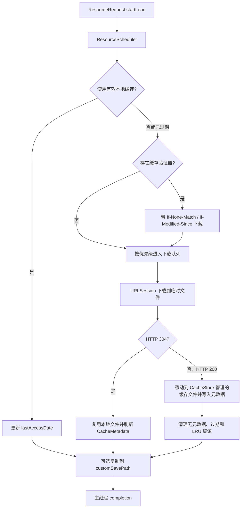

# ResourceTransferKit

`ResourceTransferKit` 是一个面向 iOS 15.6+ 的资源下载与磁盘缓存模块，用于图片、音频、视频、PDF、ZIP 和其他文件的下载。模块负责请求去重、优先级调度、并发限制、进度回调、失败重试、取消以及磁盘缓存管理。

## 集成

当前可通过本地 CocoaPods 路径集成：

```ruby
target 'YourApp' do
  use_frameworks!
  pod 'ResourceTransferKit', :path => '../ResourceTransferKit'
end
```

执行 `pod install` 后，在需要使用的文件中导入模块：

```swift
import ResourceTransferKit
```

## 模块流程



### 调度规则

- 同一完整 URL 的并发请求共用同一个下载任务；后加入的请求会合并为订阅者。
- 请求优先级分为 `.low`、`.normal`、`.high`；等待队列优先处理更高优先级请求，同优先级按创建时间排序。
- `ResourceScheduler.default.maxDownloadCount` 的可设置范围是 `3...7`，默认值为 `5`。
- 可重试的网络错误和 HTTP `408`、`429`、`500`、`502`、`503`、`504` 会自动重试；每个请求可设置 `maxFailRetryCount`，范围为 `0...5`，默认 `3` 次。
- 所有 `completion`、`errorBlock`、`progressBlock` 都在主线程执行。

### 磁盘缓存规则

- 缓存根目录为应用沙盒的 `Library/Caches/ResourceTransferKit/Cache`。
- 缓存文件名由资源完整 URL 的 SHA-256 标识生成；元数据统一保存在 `metadata.json`。
- `CacheMetadata` 记录资源键、MIME type、文件大小、最近访问时间、`Cache-Control`、`Expires`、`ETag` 和 `Last-Modified`；只有元数据与对应缓存文件都存在时才视为命中。
- 缓存新鲜度遵循响应的 `Cache-Control` 或 `Expires`。缓存过期后，如存在 `ETag` 或 `Last-Modified`，模块会发送条件请求；服务端返回 `304 Not Modified` 时复用本地文件并刷新元数据，返回新的 `200` 时则覆盖缓存内容。
- 默认最大磁盘占用为 `300 MB`，超过上限后按最近最少使用（LRU）清理到 `80%` 的目标值。
- 缓存文件最多保留 7 天。缓存初始化和每次保存时都会优先删除没有元数据记录的普通文件，随后删除过期资源并执行 LRU 清理。
- 使用 `CacheStore.default.removeAll()` 可清空模块的全部磁盘缓存。

## 多线程与并发

模块不要求调用方手动管理线程，而是在内部将下载工作、共享状态和 UI 回调分开处理：

| 场景 | 实现方式 | 调用方需要做什么 |
| --- | --- | --- |
| 多个资源并行下载 | `ResourceDownloader` 使用 `OperationQueue` 执行 `DownloadOperation`；并发数由 `maxDownloadCount` 限制在 `3...7`。 | 按需要设置 `ResourceScheduler.default.maxDownloadCount`。 |
| 相同资源的并发请求 | `ResourceScheduler` 以完整 URL 作为资源键，将同一资源的多个请求合并为一个下载上下文。 | 每个调用方照常创建并启动 `ResourceRequest`。 |
| 调度器共享状态 | 等待、下载和重试队列由 `NSLock` 保护，避免 URLSession 回调与调用方的取消操作并发修改队列。 | 不需要自行加锁。 |
| 磁盘缓存读写 | `CacheStore` 通过独立的 `NSLock` 串行化元数据和文件清理操作，避免缓存索引与文件状态不一致。 | 不需要自行加锁；不要在模块缓存目录中手动改写文件。 |
| UI 与业务回调 | 下载进度、成功与失败回调通过 `Task { @MainActor in }` 切回主线程。 | 可以直接更新 UI；耗时的业务处理应再派发到自己的后台任务。 |

例如，同时发起多个资源请求时，模块会在后台受限并发下载；相同 URL 只会建立一个网络任务：

```swift
let urls = [
    URL(string: "https://example.com/a.mp4")!,
    URL(string: "https://example.com/b.mp4")!,
    URL(string: "https://example.com/a.mp4")!
]

ResourceScheduler.default.maxDownloadCount = 4

for url in urls {
    ResourceRequest(url: url) { result in
        // 在主线程回调；重复的 a.mp4 请求共享同一个下载任务。
        print(result.localURL)
    }.startLoad()
}
```

## 使用方法

### 下载任意资源

```swift
let url = URL(string: "https://example.com/media/video.mp4")!

let request = ResourceRequest(
    url: url,
    priority: .high,
    maxFailRetryCount: 3,
    completion: { result in
        print("缓存文件：\(result.localURL)")
        print("大小：\(result.fileSize ?? 0)")
        print("类型：\(result.expectedType)")
    },
    errorBlock: { error in
        print("下载失败：\(error.localizedDescription)")
    },
    progressBlock: { progress in
        print("进度：\(Int(progress * 100))%")
    }
)

request.startLoad()
```

`ResourceDownloadResult.localURL` 始终指向模块管理的缓存文件，可直接用来读取、播放或复制资源。

### 控制本地缓存读取

`usesCacheIfAvailable` 默认为 `true`。设为 `false` 时，请求会跳过启动时可直接使用的本地缓存，进入下载流程；下载成功后仍会按响应缓存规则更新模块缓存。

```swift
let request = ResourceRequest(
    url: url,
    usesCacheIfAvailable: false
)
```

### 保存一份到业务目录

传入 `customSavePath` 后，模块在下载成功或缓存命中时都会复制一份文件到指定位置；回调中的 `result.localURL` 仍是模块缓存文件地址。

```swift
let cacheURL = URL(string: "https://example.com/files/report.pdf")!
let documentsURL = FileManager.default.urls(
    for: .documentDirectory,
    in: .userDomainMask
)[0]
let destinationURL = documentsURL.appendingPathComponent("report.pdf")

let request = ResourceRequest(
    url: cacheURL,
    customSavePath: destinationURL,
    completion: { result in
        print("缓存：\(result.localURL)")
        print("业务副本：\(destinationURL)")
    }
)
request.startLoad()
```

### 取消请求

保留发起下载的同一个 `ResourceRequest`，再调用 `cancel()`；重新创建一个相同 URL 的请求并不能取消原订阅。

```swift
request.cancel()
```

当同一资源仍有其他订阅者时，取消只移除当前订阅；没有任何订阅者时，底层下载任务会被取消。

### 加载 UIImageView

```swift
imageView.rt_load(
    resourceURL: URL(string: "https://example.com/images/cover.jpg")!,
    completion: { result in
        print("图片文件：\(result.localURL)")
    },
    errorBlock: { error in
        print("图片加载失败：\(error.localizedDescription)")
    }
)

// 视图复用或离开页面时取消。
imageView.rt_cancel()
```

`rt_load` 使用高优先级请求，并通过 `ResourceScheduler` 统一处理缓存命中和旧请求取消，避免旧下载结果覆盖新图片。

### 调整并发量与清空缓存

```swift
ResourceScheduler.default.maxDownloadCount = 4
CacheStore.default.removeAll()
```
